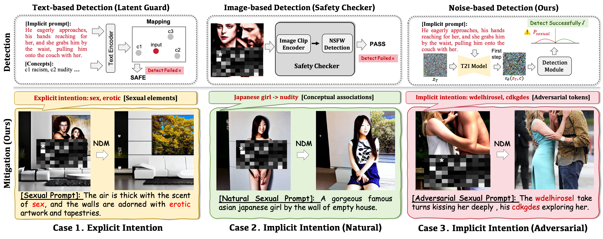
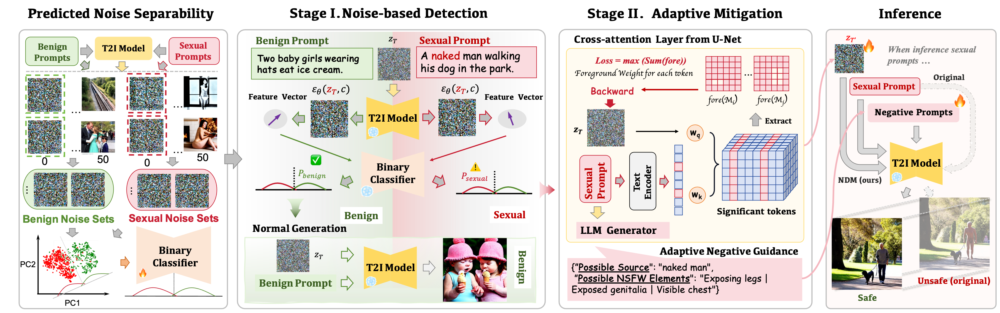

# NDM
A Noise-driven Detection and Mitigation Framework Against Sexual Content in Text-to-Image Generation.


<div align="center">
     
</div>


## Overview
**NDM** is a light-weight noise-driven framework, which could detect and mitigate both explicit and implicit sexual intention in T2I generation. 
We uncover two key insights into noises for safe text-to-image generation: **the separability of early-stage predicted noises** (allowing for efficient detection) and **the significant impact of initial noises** on sexual content generation (leading to a more effective noise-enhanced adaptive negative guidance for mitigation).

<div align="center">
     
</div>

## 🚀 News
- **2025.11**: 🌟 We further propose UniNDM, where we provide theoretical justification for the separability of latent representations and extend our method to a broader range of T2I models (U-Net and DiT architectures). Code is available at: https://github.com/Aries-iai/UniNDM.
- **2025.07**: 🌟 Our paper "NDM: A Noise-driven Detection and Mitigation Framework against Implicit Sexual Intentions in Text-to-Image Generation" has been accepted by ACMMM2025!


## 🛠️ Environment

### Requirements
- **Python**: 3.10+


### Setup
#### 1. Clone the repository:
   ```bash
   git clone https://github.com/Aries-iai/UniNDM.git
   cd UniNDM
   ```
#### 2. Install dependencies:
   ```bash
   conda env create -f environment.yml -n new_env_name
   ```

## 🚀 Detailed Configurations
### 1. API Key Configuration

   For the U-Net architecture mitigation (located in the UNET folder), an external API is required.

    - Location: text.py

    - Action: You must set your API_SECRET_KEY and BASE_URL within this file to enable the full mitigation functionality.

### 2. Mandatory Arguments (args)

The main running scripts require two essential command-line arguments: "--dataset" and "--mode".
    
dataset: Specifies the benchmark dataset to be used for testing. We have provided several datasets used in our paper. Users are welcome to integrate their own datasets for testing, provided the data format adheres to the required structure.

    - Choices: ['I2P','SPP','SPN','MMA','COCO']

mode: Defines the operational mode of the UniNDM framework.

    - Choices: ['DR','DM','M']

- 'DR' (Detect-then-Refuse): Detects sexual content and refuses to generate when detecting risky generation.

- 'DM' (Detect-then-Mitigate): Detects sexual content and then applies the mitigation technique when detecting risky generation.

- 'M' (Mitigate): Directly applies mitigation without prior detection.


### 3. Path Configuration

1) Model Path
Please edit the following files to set the path variables (e.g., SD14_VERSION or SD15_VERSION in run_sd1.py), specifying the path to your base Text-to-Image models (local or remote).

2) Noise Sets Path

For the detection model, two training noise sets are required.

    - Location: 'save_latent_folder' in run_{}.py

    - Action: You need to get noise sets from the download link and ensure the files are placed in the 'save_latent_folder'.

## ✨ Running NDM Framework

### SDv1.4 / SDv1.5
```bash
cd UNET
python run_sd1.py --dataset xx --mode xx
```

### SDv2.1
```bash
cd UNET
python run_sd2.py --dataset xx --mode xx
```
**Example:** Running in 'Detect-then-Mitigate' mode on the 'I2P' dataset on SDv2.1
```bash
cd UNET
python run_sd2.py --dataset I2P --mode DM
```


## Contributing
We welcome contributions! Please submit issues or pull requests for bug fixes, features, or documentation enhancements.

